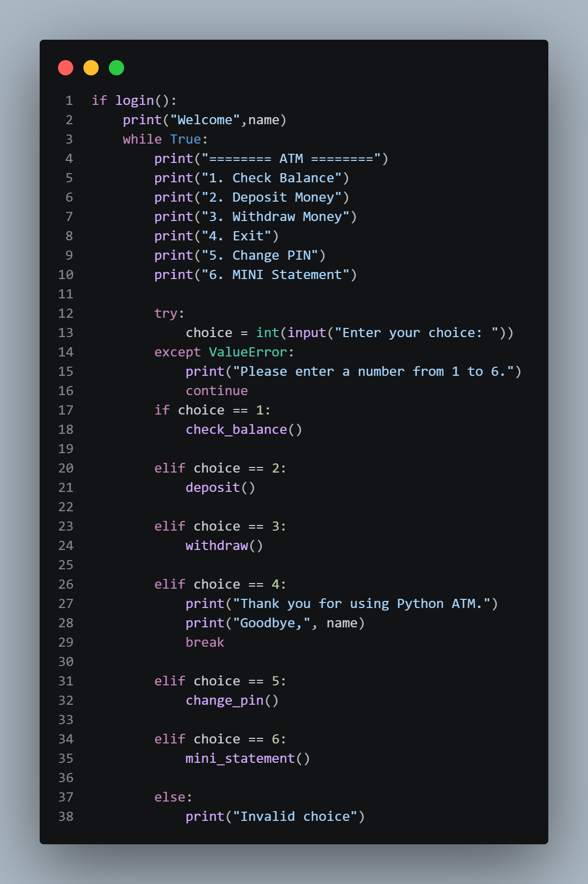

# 🏦 Python ATM Management System

A command-line ATM application developed using Python.  
This project simulates basic ATM operations such as PIN authentication, balance checking, deposit, withdrawal, PIN change, and mini statement generation.

## ✨ Features

- 🔐 PIN authentication with limited attempts
- 💰 Check account balance
- 💵 Deposit money
- 💸 Withdraw money
- 🔑 Change PIN
- 📄 Mini statement
- 📊 Transaction history
- 💾 File-based data storage
- ⚠️ Input validation and error handling

## 🛠️ Technologies & Concepts

- Python 3
- File Handling
- Functions
- `datetime`
- Exception Handling
- Git & GitHub

## 📸 Project Screenshot



## ▶️ How to Run

1. Clone the repository.
2. Open the project folder in VS Code or a terminal.
3. Run the following command:

```bash
python main.py

## 📂 Project Structure

```text
Python-ATM/
│
├── main.py
├── atm_data.txt
├── transactions.txt
├── ATM-Python-Code.png
├── README.md
└── .gitignore
```

## 🎯 Learning Outcomes

This project helped me practice Python programming, file handling, functions, input validation, exception handling, and basic project organization.

## 🎥 Project Demo

A working demonstration of this project is available in my LinkedIn post.

## 👨‍💻 Author

**Suresh Kumar**

GitHub: [SureshKumar-2007](https://github.com/SureshKumar-2007)